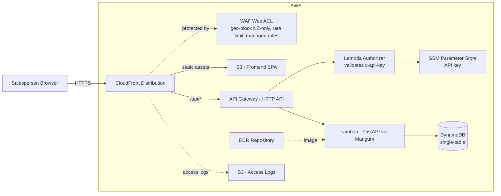
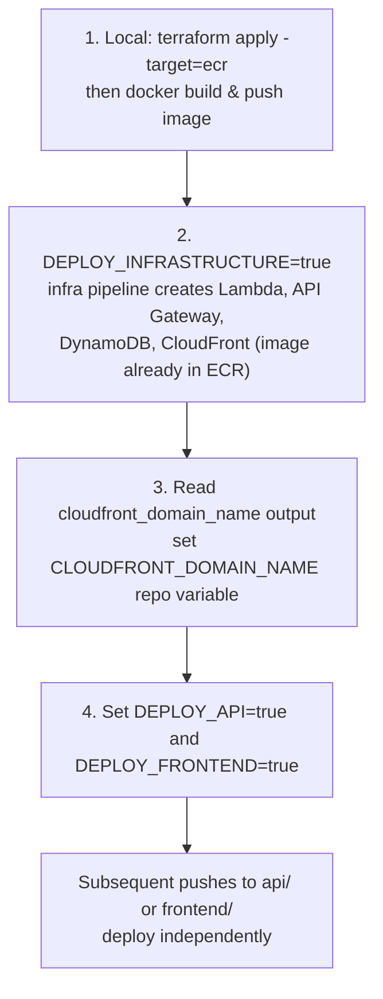

# DevOps Profile - Coffee Card Concession App Demo

A functional coffee concession card app designed to demonstrate serverless deployment on AWS. The focus is taking a non-trivial application from local development to production using modern DevOps practices.

An end-to-end showcase of:

- Serverless API on Lambda behind API Gateway, deployed via container image
- NoSQL data modelling with DynamoDB (single-table design)
- Static frontend on S3 + CloudFront, fronted by WAF
- GitHub Actions CI/CD with OIDC - no static AWS credentials

## Documentation

- [api/README.md](api/README.md) - FastAPI backend: project layout, environment variables, running tests
- [frontend/README.md](frontend/README.md) - React dashboard: components, local dev, build
- [infra/README.md](infra/README.md) - Terraform setup and provisioned AWS resources

## Repository Variables

Set these GitHub repository variables (Settings -> Secrets and variables -> Actions -> Variables) to control deployment behaviour:

| Variable                | Notes                                                     |
| ----------------------- | --------------------------------------------------------- |
| `DEPLOY_INFRASTRUCTURE` | Set to `true` to deploy infrastructure via GitHub Actions |
| `DEPLOY_API`            | Set to `true` to deploy the API to Lambda                 |
| `DEPLOY_FRONTEND`       | Set to `true` to deploy the frontend to S3/CloudFront     |

## Scenario

A salesperson operates a kiosk-style dashboard. They register walk-up customers, sell concession cards with a set number of coffee credits, and redeem coffees by ticking off credits. There is no customer-facing UI because the salesperson controls everything.

## Quick Start

**Prerequisites:** [Docker](https://docs.docker.com/get-docker/), [Docker Compose](https://docs.docker.com/compose/install/), [pnpm](https://pnpm.io/installation)

Install frontend dependencies once (see [frontend/README.md](frontend/README.md) for details):

```bash
cd frontend && pnpm install
```

Then from the repository root:

| Command     | Does                                                                |
| ----------- | ------------------------------------------------------------------- |
| `make dev`  | Starts DynamoDB Local + API in Docker, runs the frontend dev server |
| `make down` | Stops all Docker services                                           |
| `make seed` | Seeds sample data (Alice + Bob + cards)                             |
| `make logs` | Tails API logs                                                      |

The frontend is available at `http://localhost:5173`, the API at `http://localhost:8000`.

## Architecture

See more about the C4 Models diagram methodology: [C4 Models](https://c4models.com)

### System Context

> 

### Container

> 

### AWS Resources



## Tech Stack

| Layer          | Choice                                                        | Details                                                 |
| -------------- | ------------------------------------------------------------- | ------------------------------------------------------- |
| API            | Python 3.12, FastAPI, DynamoDB (boto3), AWS Lambda via Mangum | [api/README.md](api/README.md)                          |
| Frontend       | React 19, Vite, Tailwind CSS v3, TypeScript                   | [frontend/README.md](frontend/README.md)                |
| Infrastructure | Terraform - Lambda, API Gateway, DynamoDB, S3/CloudFront, WAF | [infra/README.md](infra/README.md)                      |
| CI/CD          | GitHub Actions, OIDC federation (no static AWS credentials)   | See [Repository Variables](#repository-variables) below |

## Data Models

### Customer

| Field       | Type     | Notes                                 |
| ----------- | -------- | ------------------------------------- |
| id          | UUID     | Primary key                           |
| name        | str      | Required                              |
| email       | EmailStr | Optional                              |
| is_archived | bool     | Soft-delete flag, defaults to `false` |
| created_at  | datetime | Set on creation                       |

### Card

| Field         | Type     | Notes                                        |
| ------------- | -------- | -------------------------------------------- |
| id            | UUID     | Primary key                                  |
| customer_id   | UUID     | Reference to Customer                        |
| total_credits | int      | Set on purchase (default 5)                  |
| credits_used  | int      | Incremented on redeem, decremented on refund |
| is_archived   | bool     | Soft-delete flag, defaults to `false`        |
| created_at    | datetime | Set on creation                              |

## API Endpoints

### Customers

| Method | Path                           | Notes                                                      |
| ------ | ------------------------------ | ---------------------------------------------------------- |
| GET    | `/api/customers`               | `?search=` partial name match; `?include=archived` for all |
| POST   | `/api/customers`               | Body: `{ name, email? }`                                   |
| GET    | `/api/customers/{customer_id}` | Returns customer with nested active cards                  |
| PATCH  | `/api/customers/{customer_id}` | Updates `name`, `email`, or `is_archived`                  |
| DELETE | `/api/customers/{customer_id}` | Soft-archives; returns updated customer                    |

### Cards

| Method | Path                                                  | Notes                                          |
| ------ | ----------------------------------------------------- | ---------------------------------------------- |
| GET    | `/api/customers/{customer_id}/cards`                  | `?include=archived` to include archived cards  |
| POST   | `/api/customers/{customer_id}/cards`                  | Creates card with 5 credits                    |
| PATCH  | `/api/customers/{customer_id}/cards/{card_id}`        | Updates `is_archived`                          |
| DELETE | `/api/customers/{customer_id}/cards/{card_id}`        | Soft-delete via `is_archived`                  |
| POST   | `/api/customers/{customer_id}/cards/{card_id}/redeem` | Increments `credits_used`; 409 if at capacity  |
| POST   | `/api/customers/{customer_id}/cards/{card_id}/refund` | Decrements `credits_used`; 409 if already zero |

### Health

| Method | Path          | Notes                                                  |
| ------ | ------------- | ------------------------------------------------------ |
| GET    | `/api/health` | Returns `version`, `uptime_seconds`, `database` status |

## Business Rules

1. A card is created with a configurable number of credits (default 5).
2. Each redemption increments `credits_used` by 1.
3. A redemption on a card with no remaining credits returns 409 Conflict.
4. A refund decrements `credits_used` by 1, down to 0.
5. A refund on a card with 0 credits used returns 409 Conflict.
6. Deleting a customer or card sets `is_archived = true`. Archived records are excluded from listings by default and can be restored via `PATCH`.

## Frontend

A single-page salesperson dashboard providing:

- A search bar to find customers by name
- A register button to create new customers
- A customer view showing active cards and remaining credits
- Redeem and refund buttons on each card

No customer-facing UI, no QR codes. Access is gated by a shared API key (see [Future Improvements](#authentication-and-authorization) for per-user auth).

### Why not a BFF?

A Backend-for-Frontend layer was considered and deliberately skipped. The app has one frontend, a single shared API key for access control, and each view maps to a single API call. The static SPA calling FastAPI directly keeps the architecture simple and the CI/CD pipeline focused on two services rather than three.

### Deployment Sequencing

These variables have an unfortunate ordering dependency, since the API and frontend deployments rely on infrastructure that doesn't exist until the first infra run completes - and the infra run itself can't create the Lambda until an image exists in ECR:

1. **Locally**: `terraform apply -target=aws_ecr_repository.api` to create just the ECR repo, then build and push an image (see [infra/README.md](infra/README.md)).
2. Set `DEPLOY_INFRASTRUCTURE=true` and run the infra pipeline. With an image now in ECR, Terraform can create the Lambda, API Gateway, DynamoDB, and the CloudFront distribution.
3. Note the generated CloudFront distribution domain and set `CLOUDFRONT_DOMAIN_NAME` accordingly.
4. Set `DEPLOY_API=true` and `DEPLOY_FRONTEND=true` to enable application deployments on subsequent runs.



See [Future Improvements](#removing-the-deployment-sequencing-dependency) for how this sequencing could be removed entirely.

## Repository Structure

A single repository containing application code and infrastructure:

- `api/` - FastAPI backend ([details](api/README.md))
- `frontend/` - React dashboard ([details](frontend/README.md))
- `infra/` - Terraform infrastructure ([details](infra/README.md))

The OIDC roles GitHub Actions assumes to deploy (`github-actions-deploy-*`, `github-actions-tf-plan-*`, `github-actions-tf-apply-*`) are provisioned separately in the `wjkw1/aws-foundations` repository, not here.

## Future Improvements

### Removing the deployment sequencing dependency

The [Deployment Sequencing](#deployment-sequencing) steps exist because the frontend and API pipelines depend on an infrastructure output that doesn't exist until the first run. The cleanest fix removes that dependency rather than working around it: provision a stable, known CloudFront domain upfront (e.g. a fixed alias via Route53/ACM) so `CLOUDFRONT_DOMAIN_NAME` never needs to be discovered after deploy. Combined with splitting the API and frontend into their own repositories, each component - infrastructure, API, and frontend - becomes independently versioned and deployable via its own pipeline, triggered only by its own changes, with no shared repository variables or manual sequencing required after the initial bootstrap.

### Authentication and authorization

The dashboard is currently open to anyone who can reach the URL and has the shared API key. The highest-value addition would be Cognito-backed login with JWT authorization on the API, so only authenticated salespeople can view or modify customer and card data. This also becomes a prerequisite for any customer-facing self-service work, since that would require distinguishing salesperson sessions from customer sessions.

### Per-redemption audit trail

Redemptions and refunds currently only adjust a `credits_used` counter on the card, with no record of individual events. Adding an append-only audit record (timestamp, card, customer, action, and eventually the authenticated salesperson) would support dispute resolution, usage reporting, and fraud detection without changing the core card model.

### Customer-facing UI or self-service

A separate, lightweight UI (or view) that lets a customer check their own card balance and redemption history. This is the largest scope addition of the future improvements, since it introduces a second frontend audience, requires authentication for customers (distinct from salesperson auth above), and likely needs its own routing and access controls. Best tackled after authentication is in place.

### Card expiry

Add an optional `expires_at` to cards so that unused credits lapse after a configurable period. This is a small data model change (one new attribute and a check in the redeem path) but has business implications - e.g. whether expired credits should be visible, refundable, or simply blocked from redemption - that would need product input before implementation.

Now, my opinion is that the correct thing to do is to _auto refund_ portion of the credits if unused after 1 year.

### Fuzzy search

The current customer search (`?search=`) is a partial name match. Fuzzy matching (e.g. tolerating typos or transpositions) would improve usability for a busy kiosk environment but adds complexity to a DynamoDB single-table design, which doesn't support this natively - likely requiring either a secondary search index (e.g. OpenSearch / Elastic) or client-side filtering on a prefetched customer list.

### QR codes or physical card integration

Generating a QR code per customer (linking to that card's ID) would let a salesperson scan a physical card or mobile QR code to pull up the customer record directly, rather than searching by name.

### UI & UX improvements 🫣

loading/error states for API calls, mobile-responsive layout for the dashboard, optimistic UI updates on redeem/refund, toast notifications instead of alerts, dark mode.
